# Movie Collector 🎥
# Genel Özet
Bu proje  Staj-I esnasında Flutter'da kendimi geliştirmek için yaptığım uygulamadır. Uygulama içinde https://www.themoviedb.org/ sitesinin API'nı kullanarak filmleri görüntüleyebildiğiniz, film arayabildiğiniz ve Firebase kullanarak filmleri Watchlist, Favorites veya Watcheda ekleyebileceğiniz MovieCollector uygulamasında TR/ENG dil desteği ve dark-light theme seçenekleri bulunmaktadır.

# Uygulama İçi Görseller
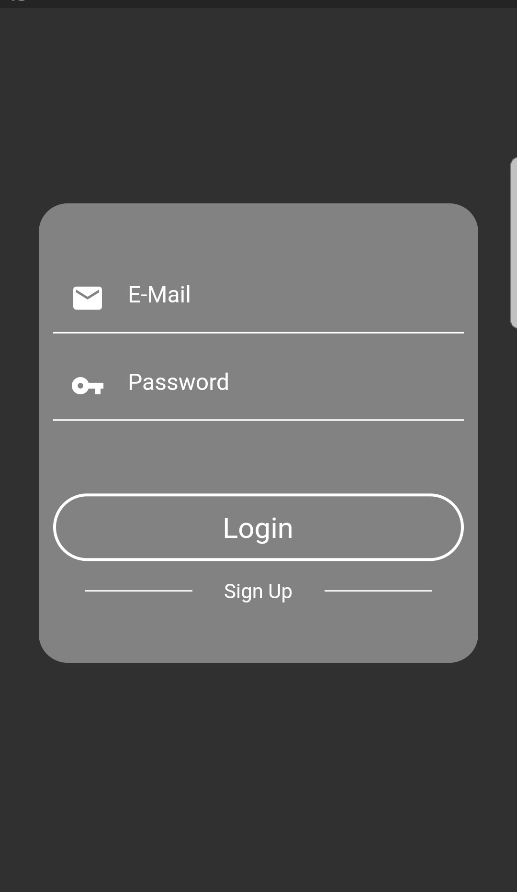 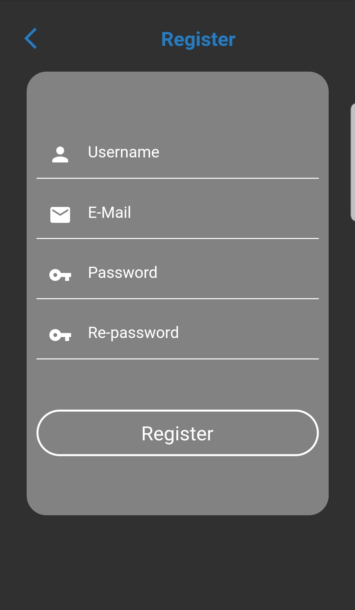

Giriş ve Kayıt Ekranları

## Uygulama açılış ekranı
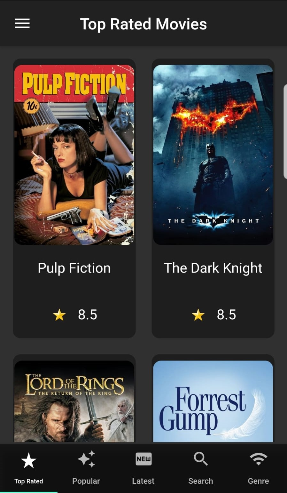 

##  Detay Sayfası
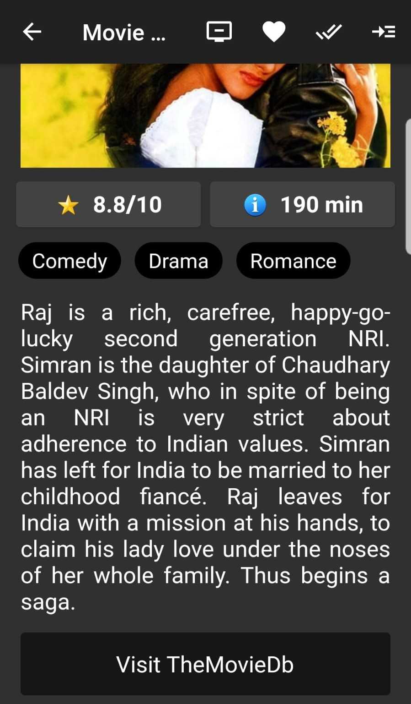 

Ekranda görüntülenen filmlerin üstüne tıklandığında gidilen film detay sayfası. Sayfanın appbarında yer alan butonları kullanarak watchliste , favoritese veya watched ekleme yapabilir veya bu filmi begendiyseniz bu filmin benzerlerinin listelendiği sayfaya götürecek butonu kullanabilirsiniz. 

## Arama Sayfası
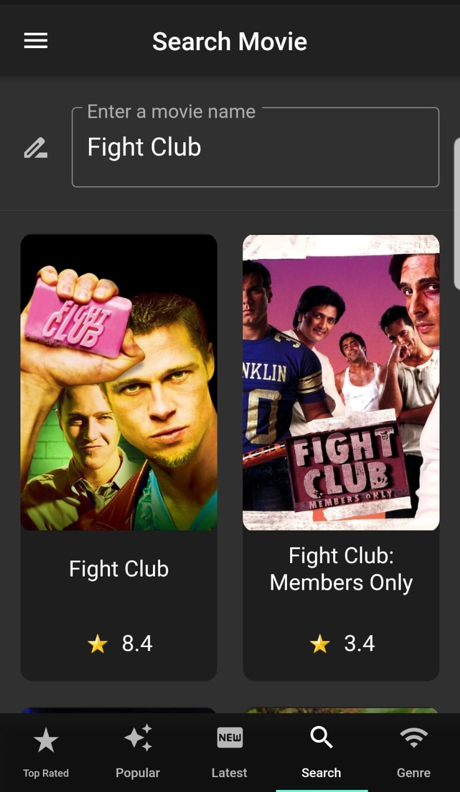 

BottomNavBar'da yer alan diğer bir sekme olan Search sayfasında isme göre film arayabilirsiniz.

## Tür Sayfası
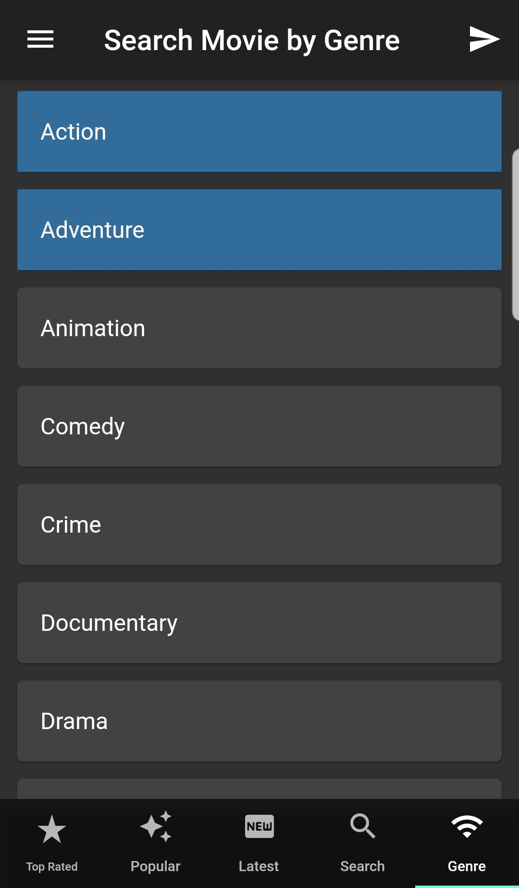 

BottomNavBar'da yer alan diğer bir sekme olan Genre sayfasında film türlerinden bir veya birden fazla film seçerek filmleri filtreleyebilirsiniz.

## Drawer
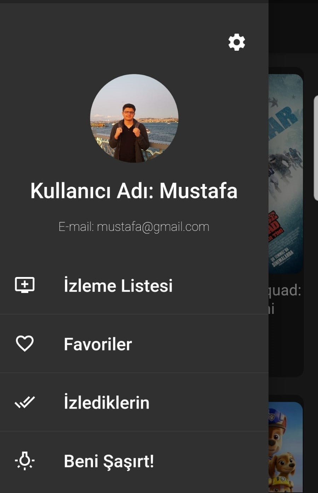 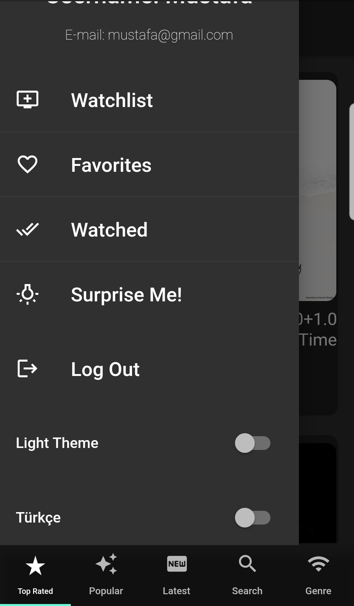

Sayfalarda yer alan drawer, kayıt olurken profil bilgilerini görüntüleyen ve güncelleme yapabileceğiniz,kaydettiğimiz filmleri görüntülemek, çıkış yapmak, kararsız kaldıgınızda kullanabileceğiniz beni şaşırt,dil ve tema değiştirme gibi özellikleri tutan yapıdır.

## Profil Güncelleme Sayfası
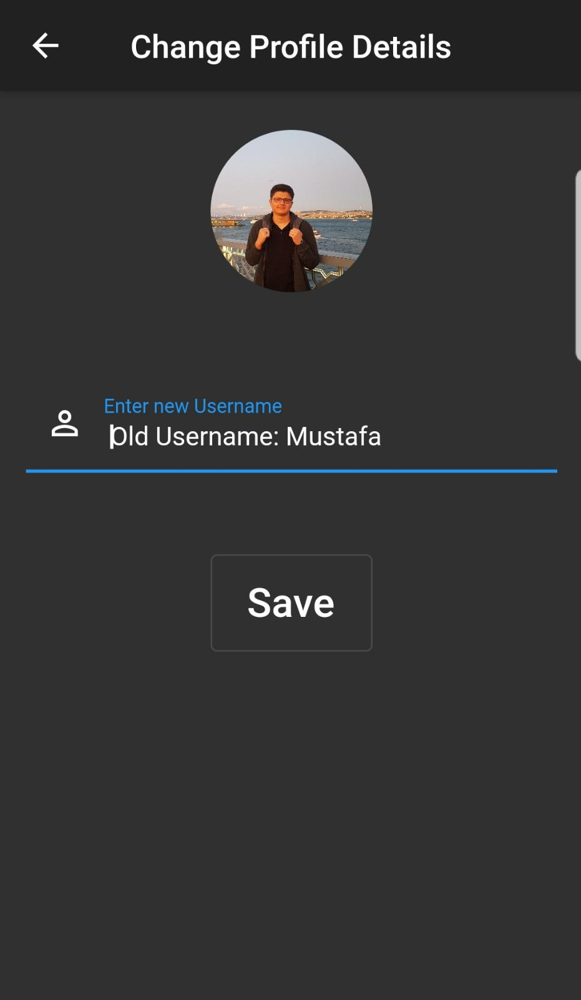

Kayıt olurken seçtiğiniz kullancı adı ve profil fotografınızı buradan güncelleyebilirsiniz.

## İzleme Listesi Sayfası
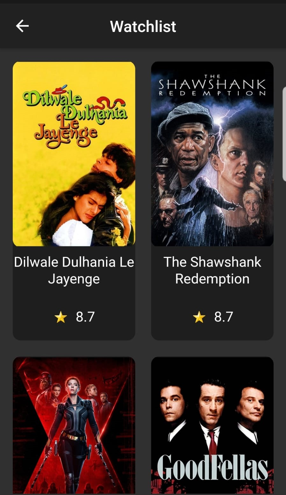 

İzleme listenize eklediğiniz filmlere buradan bakabilirsiniz.

## Tema Değişikliği
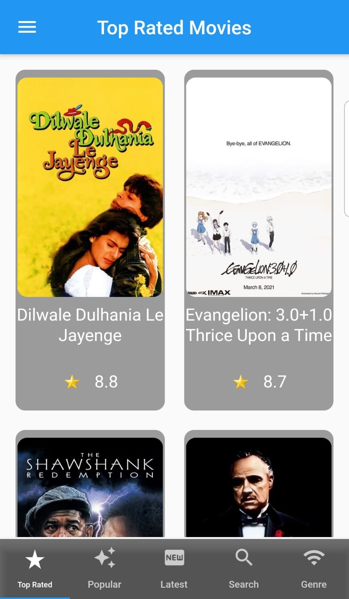 

Drawer'da yer alan tema değiştirmeyi kullanarak açık temaya geçebilirsiniz.

## Beni Şaşırt Sayfası
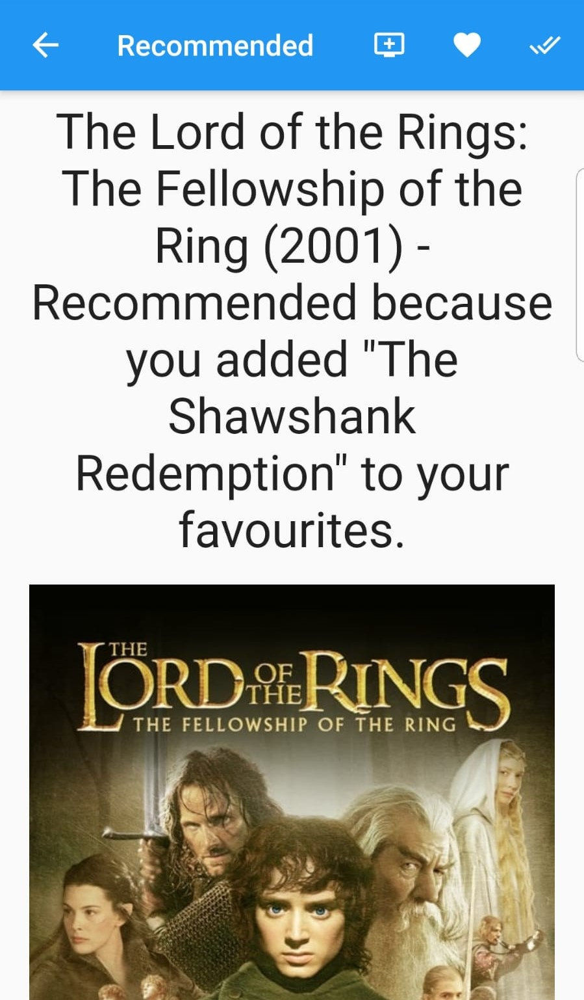 

Drawer'da yer alan SurpriseMe butonunu kullanarak favorilerinize eklediğiniz filmlerden rastgele birini ele alarak size o filme benzeyen, begenebileceğiniz bir filmi görüntüler.

## Dil değişikliği
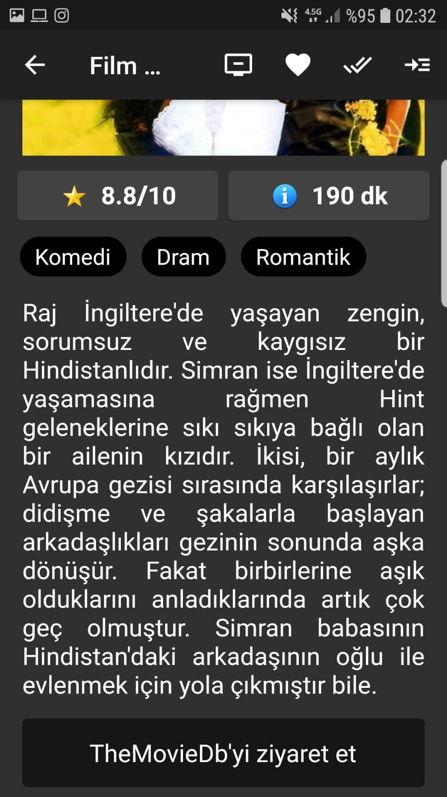  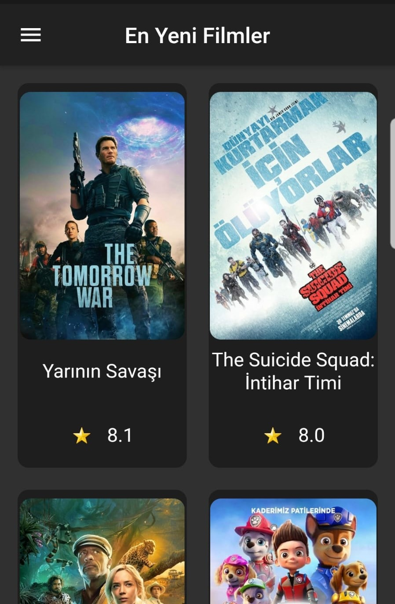

Drawer'da yer alan dili değiştirmeyi kullanarak Türkçe diline geçebilirsiniz. Türkçe kullanılmaya  başladıktan sonra uygulama içinde dil dışında bir değişiklik bulunmamaktadır.

# İletişim
[@MustafaErenn](https://github.com/MustafaErenn)
[Linkedin](https://www.linkedin.com/in/mustafa-eren-9214661b3/)
